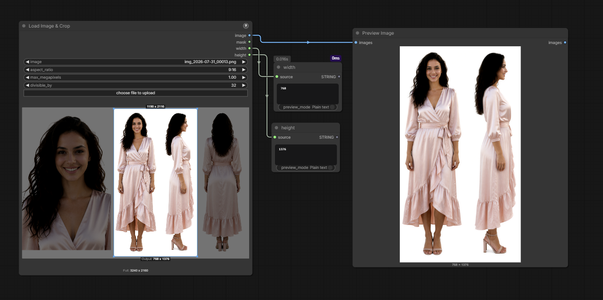
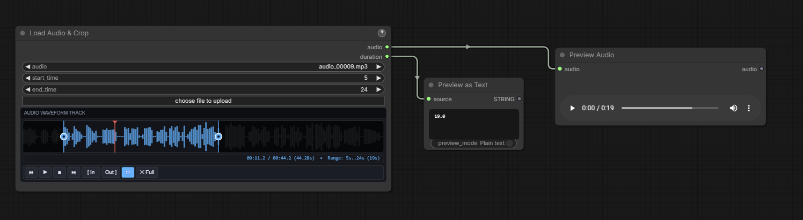
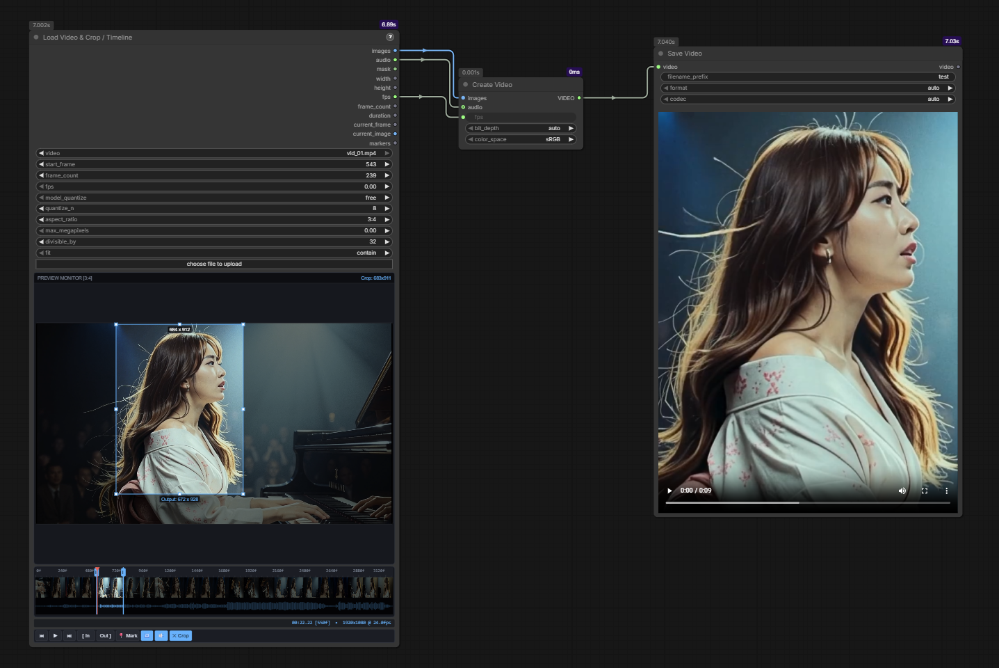

# comfyui-reference-loader

Interactive media loading and cropping nodes for ComfyUI. Visually scrub, preview, crop, and trim videos, audio, and images directly on the node graph.

## Features

- **Load Image & Crop**: Visual crop box drawn right on the image preview, with aspect ratio locking, megapixel downscaling, and VAE dimension alignment.
- **Load Audio & Crop**: Interactive audio waveform player with draggable trim handles to set start and end times visually.
- **Load Video & Crop / Timeline**: Full video player with visual filmstrip, audio waveform, interactive spatial crop box, In/Out trimming, freeze markers, and diffusion model frame quantization presets (Wan, Hunyuan, LTX, Cosmos, Mochi, MiniMax).
- **Downscale Image to Megapixels**: Lightweight utility node to downscale images to a target megapixel budget while preserving aspect ratio.

---

## Installation

Clone or copy this repository into your `ComfyUI/custom_nodes` directory:

```bash
cd ComfyUI/custom_nodes
git clone https://github.com/sthao42/Comfyui-reference-loader.git
```

Restart ComfyUI. No extra Python dependencies required (uses PyAV / standard ComfyUI libraries).


---

## Security Notes

This package reads files supplied by the user, so its security properties are:

- **No custom routes**: file access in the browser goes through ComfyUI core's `/view` endpoint (restricted to the configured `input`/`output`/`temp` folders). The widgets additionally validate the `type` and reject `..`, absolute, and Windows drive-letter path segments before building a URL.
- **No DOM injection**: all previews render to `<canvas>`; no `innerHTML`, `eval`, or `new Function` is used. All event listeners are removed when a node is deleted.
- **Bounded decoding**: video loads stop after 1,000,000 decoded frames (set `frame_count` to bound shorter loads), and audio loads decode only the requested crop window — memory use is bounded by the crop, not the whole file.
- **Waveform size cap**: video audio-waveform fetches abort when the file exceeds 250 MB.
- **Symlinks**: as with ComfyUI core, a symlink/junction inside `input/` pointing elsewhere can escape the folder restriction. Keep your input folder under your control if the ComfyUI server is reachable by untrusted users.
- **CORS**: only enabled when ComfyUI is started with `--enable-cors-header` (off by default).

---

## Nodes

### 1. Load Image & Crop (`reference_loader/image`)



Loads an image with visual crop controls right on the preview:

- **Interactive Cropping**: Click & drag on the preview to draw a crop box; drag inside to move; drag corners to resize; click outside to reset.
- **Aspect Ratio Locking**: Lock crop proportions with descriptive presets (`1:1 (Square)`, `16:9 (Widescreen)`, `9:16 (Widescreen Portrait)`, `3:2 (35mm Standard)`, `4:3 (Standard)`, `21:9 (Ultrawide)`, etc.) or `None` for freeform.
- **Megapixel Budget & Alignment**:
  - `max_megapixels`: Scales the cropped or full image down if it exceeds the pixel budget.
  - `divisible_by`: Snaps output width and height to multiples of 8, 16, 32, or 64 for VAE compatibility.
- Works in both classic canvas and Nodes 2.0 (Vue).

**Outputs**: `image` (IMAGE), `mask` (MASK from alpha channel), `width` (INT), `height` (INT).

---

### 2. Load Audio & Crop (`reference_loader/audio`)



Loads an audio file with an interactive waveform player:

- **Visual Waveform**: High-resolution audio peak visualizer with playback cursor.
- **Playback Controls**: Play / Pause (<kbd>Space</kbd>), Stop, Step (<kbd>←</kbd> / <kbd>→</kbd>), and Loop toggle.
- **Draggable Trim Handles**:
  - Drag cyan pins to adjust Start and End crop points.
  - Drag between handles to slide the crop window across the timeline.
  - Click outside or click `✕ Full` to reset to the full track.
  - Two-way binding with `start_time` and `end_time` inputs (snaps to seconds).

**Outputs**: `audio` (AUDIO dictionary `{"waveform": tensor, "sample_rate": int}`), `duration` (FLOAT in seconds).

---

### 3. Load Video & Crop / Timeline (`reference_loader/video`)



Loads a video file with an interactive editor directly on the canvas:

- **Live Video Monitor & Spatial Cropper**:
  - Drag on the video preview to draw an exact crop region.
  - Drag inside the selection to move it, or drag any corner / edge handle to resize.
  - Click outside or press <kbd>C</kbd> to reset back to full frame.
  - Live dimension badges show both source crop size and final scaled output dimensions.
- **Filmstrip Timeline & Waveform**:
  - Visual image thumbnail filmstrip across the duration of the video.
  - Synchronized audio waveform track underneath the filmstrip.
- **Playback & Trimming**:
  - Play / Pause (<kbd>Space</kbd>) with real-time playhead scrubbing and audio playback.
  - Frame stepping (<kbd>←</kbd> / <kbd>→</kbd> or <kbd>[</kbd> / <kbd>]</kbd>).
  - Set In / Out trim points (<kbd>I</kbd> and <kbd>O</kbd>) or drag the trim handles on the ruler.
  - Freeze markers (<kbd>M</kbd>) to mark key frames along the timeline.
- **Diffusion Model Quantization Presets**:
  - Automatically snaps frame counts to required diffusion model grids: `Wan (4n+1)`, `Hunyuan (4n+1)`, `LTX (8n+1)`, `Cosmos (8n+1)`, `Mochi (6n+1)`, `MiniMax H3 (17n+5)`, or custom multiples of `N`.
- **Aspect Ratio & Sizing**:
  - Lock crops to descriptive aspect ratio presets (`1:1 (Square)`, `16:9 (Widescreen)`, `9:16 (Widescreen Portrait)`, `3:2 (35mm Standard)`, `4:3 (Standard)`, `21:9 (Ultrawide)`, etc.) or `None` for freeform.
  - Fit modes: `contain` (letterbox pad), `cover` (center crop), `stretch`.
  - Megapixel capping (`max_megapixels`) and dimension alignment (`divisible_by`: 8, 16, 32, 64).

**Outputs**: `images` (IMAGE batch), `audio` (AUDIO), `mask` (MASK), `width`, `height`, `fps`, `frame_count`, `duration`, `current_frame`, `current_image`, `markers`.

---

### 4. Downscale Image to Megapixels (`reference_loader/image`)

Helper utility that scales an image down so its total pixel count fits within `megapixels` while preserving aspect ratio. Images already within budget pass through untouched.

---

## Keyboard Shortcuts

| Key | Action |
| --- | --- |
| <kbd>Space</kbd> | Play / Pause playback |
| <kbd>←</kbd> / <kbd>→</kbd> or <kbd>[</kbd> / <kbd>]</kbd> | Step backward / forward (1 frame for video, 1s for audio) |
| <kbd>I</kbd> | Set In-point / Start trim |
| <kbd>O</kbd> | Set Out-point / End trim |
| <kbd>M</kbd> | Toggle freeze marker on current frame *(Video)* |
| <kbd>Shift</kbd> + <kbd>M</kbd> | Clear all markers *(Video)* |
| <kbd>U</kbd> | Toggle Mute / Unmute audio *(Video)* |
| <kbd>C</kbd> | Clear spatial crop back to full frame *(Video)* |

---

## License

[GPL-3.0](LICENSE)
